<h1 align="center">The Tells</h1>
<p align="center"><b>A measurable taxonomy of the AI-generated design look, and a harness to escape it.</b></p>

<p align="center">
  <a href="https://pypi.org/project/ai-design-tells/"></a>
  <a href="https://pypi.org/project/ai-design-tells/"></a>
  
  
  
  
  
</p>

<p align="center">
  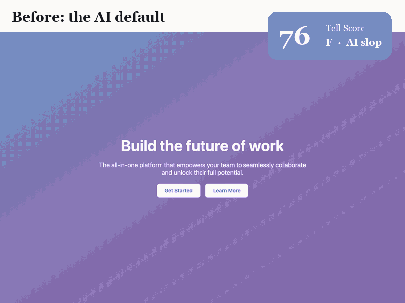
</p>
<p align="center"><sub>The same landing page. <b>Only the tell-bearing choices change</b>, font, color, layout, motion, copy. Content and structure are held fixed. The Tell Score falls from <b>77 (F, textbook AI slop)</b> to <b>0 (A, reads as human-crafted)</b>.</sub></p>

---

Interfaces made by generative models are instantly recognizable: an indigo→violet
gradient, Inter on white, a hero with three emoji feature cards, one border-radius,
one soft shadow, and a headline that says *build the future of work*. Teams burn
real time and tokens trying to make AI output **not look like AI**, and treat the
target as ineffable taste.

It isn't. **The AI look is a finite, enumerable set of statistical defaults**, so
it can be written down, weighted, and measured. This repo is the taxonomy (27
tells), a transparent detector (the **Tell Score**, 0–100, lower is better), and a
harness so any team or coding agent can audit and prevent the look.

## Contents

- [Installation](#installation) · [**Use it as an MCP / Claude Code plugin**](#what-your-agent-gets-mcp-tools) · [Quickstart](#quickstart) · [The result](#the-result) · [Validated on 202 real sites](#validated-on-202-real-sites-v2) · [Component spec catalog](#component-spec-catalog-v3) · [Korean web catalog](#korean-web-한글-catalog) · [Field evidence](#field-evidence-two-production-manifestos-v4) · [The 27 tells](#the-27-tells)
- [The harness: CLI · MCP · drop-in prompt](#the-harness)
- [Figure gallery](#figure-gallery) · [How it works](#how-it-works) · [Honest limits](#honest-limits)
- [Paper & citation](#paper) · [Repo layout](#repo-layout)

## Installation

Pick one. All of them give your agent (or your terminal) the same Tell Score detector.

### Option 1 · Claude Code plugin (recommended)

One command registers the MCP server, no JSON to edit:

```bash
/plugin marketplace add hankimis/ai-design-tells
/plugin install ai-design-tells@iov-labs
```

Now your agent **audits the UI it just wrote before showing it to you** and gets the exact fixes.
(Needs [uv](https://docs.astral.sh/uv/) on your PATH; the server runs via `uvx`.)

### Option 2 · MCP in any client (uvx)

Drop this into your MCP config (Claude Code `.mcp.json`, Cursor `~/.cursor/mcp.json`, Claude Desktop):

```jsonc
{ "mcpServers": { "ai-design-tells": {
  "command": "uvx",
  "args": ["--from", "ai-design-tells[mcp]", "ai-design-tells-mcp"] } } }
```

### Option 3 · pip (CLI + MCP)

```bash
pip install ai-design-tells              # the detector + the `ai-design-tells` CLI (pure stdlib)
pip install "ai-design-tells[mcp]"       # + the MCP server  (ai-design-tells-mcp)
pip install "ai-design-tells[live]"      # + audit_url, renders a live page (Playwright)
```

### Option 4 · Clone and run (zero install)

The detector core is pure Python standard library, so no install is needed at all:

```bash
git clone https://github.com/hankimis/ai-design-tells && cd ai-design-tells
python src/cli.py fixtures/ai-default.html
```

On PyPI: [`ai-design-tells`](https://pypi.org/project/ai-design-tells/) · `pip install` gives two
commands, `ai-design-tells` (CLI) and `ai-design-tells-mcp` (MCP server).

## What your agent gets (MCP tools)

Once registered (Option 1 or 2), just ask:

> *"Score this page for AI design tells and fix the ones that fired."*

| tool | what it does |
|---|---|
| `score_design(html)` | score an HTML/JSX string; returns Tell Score, grade, every fired tell (nickname + evidence + fix) |
| `score_file(path)` | same, for a local `.html` file |
| `audit_url(url)` | score a **live deployed site** (needs the `[live]` extra: Playwright) |
| `list_tells()` | the full taxonomy (27 tells, nicknames, weights, why, fix) |
| `component_specs()` | measured CSS targets from 199 real sites (button, type, spacing, light + dark color) |
| `korean_specs()` | CSS targets for the Korean (hangul) web |
| `harness_prompt()` | a ready-to-paste prompt that pre-empts the tells at generation time |

The loop is **generate → `score_design` → fix → re-score**, driven by the agent with no human in the middle for the mechanical part.

## Quickstart

```bash
# installed: score one page (exit code = the integer Tell Score, gates CI)
ai-design-tells page.html

# or, with zero install, from a clone:
git clone https://github.com/hankimis/ai-design-tells && cd ai-design-tells
python src/cli.py fixtures/ai-default.html            # 77  (F)
python src/cli.py fixtures/refined.html               # 0   (A)
python src/cli.py fixtures/catalog-sample.html        # 0   (A)  built to the v3 catalog, light + dark

# score a whole corpus as a leaderboard
python src/cli.py fixtures/*.html --quiet

# verbose: every fired tell (with its nickname), the evidence, and the fix
python src/cli.py fixtures/ai-default.html -v
```

The process exit code **is** the integer Tell Score, so it gates CI:

```bash
python src/cli.py build/index.html && echo "ships clean" || echo "too many tells"
```

**Audit a live, deployed site** (v2, renders it in headless Chrome and reads computed styles):

```bash
pip install "ai-design-tells[live]"      # adds Playwright; then: playwright install chromium
python scripts/audit_url.py https://your-site.com
# Stripe scores 0 (A) even with 123 purple accents, its craft credits offset them.
```

<p align="center">
  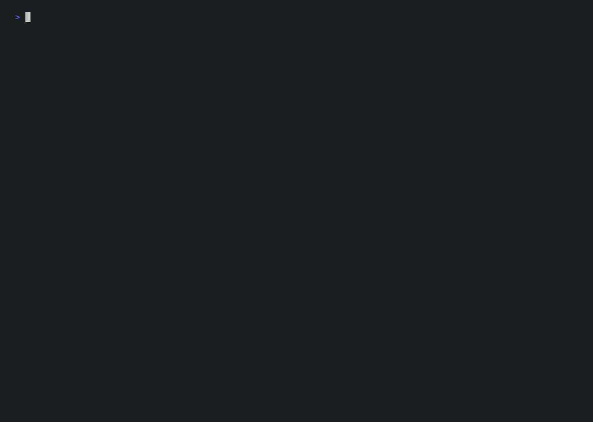
</p>
<p align="center"><sub>The harness scoring a corpus, then auditing a designed page, reproducible with one command.</sub></p>

## The result

The headline is **confound-controlled**: one page, refactored so that *only the
tell-bearing properties change*, same product, same four sections, same
information. Any score change is design, not content.

<p align="center">
  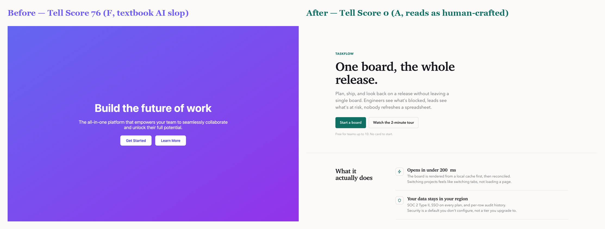
</p>
<p align="center"><sub><b>Left:</b> the AI default (77, F), gradient, Inter, centered, emoji cards, one radius, one shadow, vague headline, plus the AI-assistant reflex (sparkle icon, an "AI-powered" label, a card-in-card, multi-color pills, micro-type). <b>Right:</b> the refactor (0, A), a serif display with negative tracking, a brand ink + one accent as tokens, an editorial grid, hairline rows, designed microstates, a specific voice.</sub></p>

| corpus page | family | Tell Score | grade |
|---|---|---:|---|
| `ai-default` (landing) | AI-default | **77** | F, textbook AI slop |
| `slop-dashboard` | AI-default | **54** | D, strong AI-default signature |
| `slop-pricing` | AI-default | **47** | D |
| `refined` (the refactor) | Designed | **0** | A, reads as human-crafted |
| `designed-docs` (changelog) | Designed | **0** | A |
| `designed-pricing` | Designed | **0** | A |

Across the corpus the two families separate with **no overlap** (nearest pair 47
points apart). Every fix pays down the score, in order of impact:

<p align="center">
  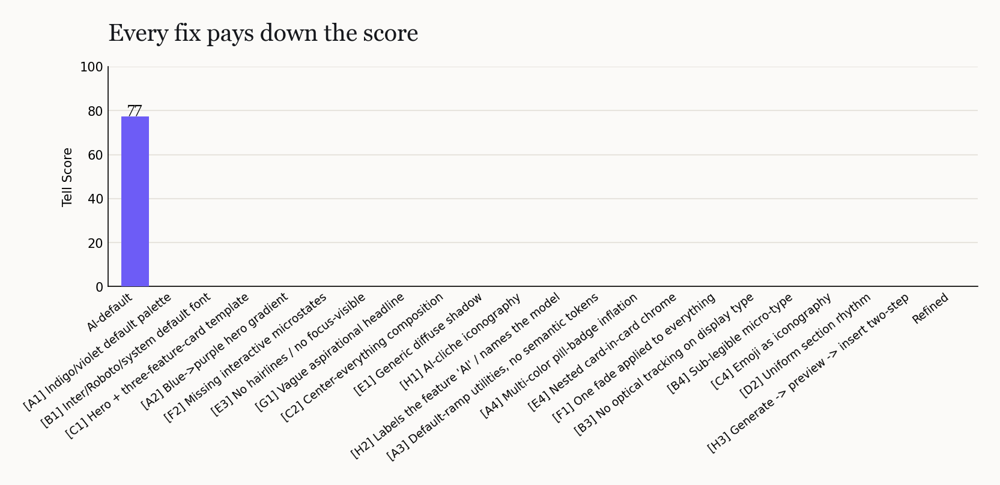
</p>
<p align="center"><sub>Color, type, the template layout, and the gradient do most of the work; microstates and copy close the gap to zero.</sub></p>

> The designed pages score **0 by construction**, they were authored to be
> tell-free. That demonstrates the fixes are *sufficient* to zero the score; it is
> **not** a claim that real sites in the wild score 0. The load-bearing results are
> the confound-controlled refactor and the family separation. See [Honest limits](#honest-limits).

## Validated on 202 real sites (v2)

A fair objection: maybe the detector just flags *everything* as AI. So we rendered
**202 design-led, human-crafted sites** (Stripe, Linear, Toss, Apple, Vercel,
Figma, Notion, Anthropic, OpenAI, Airbnb, and 192 more) in headless Chrome, read
their **computed styles**, and *learned* the empirical distribution of real design.

<p align="center">
  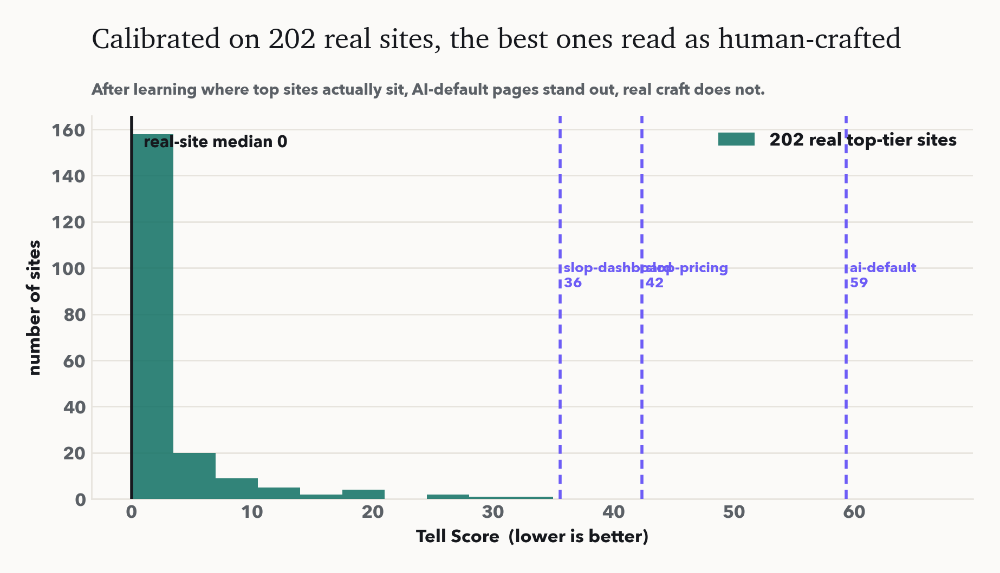
</p>
<p align="center"><sub>Recalibrated on the data, the 202 real top-tier sites score at a <b>median of 0 (93% grade A)</b>; the AI-default pages still stand far out at 35 to 59. The instrument distinguishes machine-default from human-crafted <b>on real data, not just fixtures</b>.</sub></p>

The data overturns two naive rules and forces a better model:

- **Purple is not a tell.** A third of top sites use purple; **Stripe paints 123 purple accents and scores 0**. Only the *exact AI-default indigo*, or purple with no compensating craft, counts.
- **Inter is not a tell.** A quarter of top sites use Inter or the system stack (**Linear** among them) with a real type system. The tell is the font *with no optical tracking and no scale*.

So no single signal is the tell. The recalibrated detector uses a **craft-credit model**: a page earns credits for a custom display face, optical tracking, a radius hierarchy, and a designed focus state, and those credits **offset cosmetic defaults**. The AI look is the bundle of defaults *with nothing compensating*.

<table>
<tr>
<td width="50%">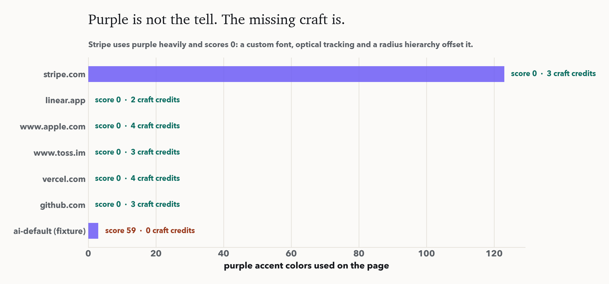<br><sub><b>Craft credits.</b> Stripe uses purple heavily and scores 0; the AI default has less purple and scores 59.</sub></td>
<td width="50%">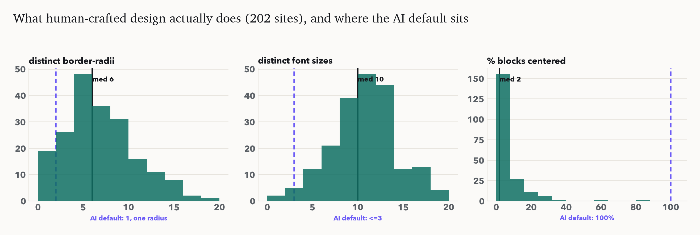<br><sub><b>Learned thresholds.</b> Real sites use many radii and sizes, and almost never center everything.</sub></td>
</tr>
</table>

<p align="center">
  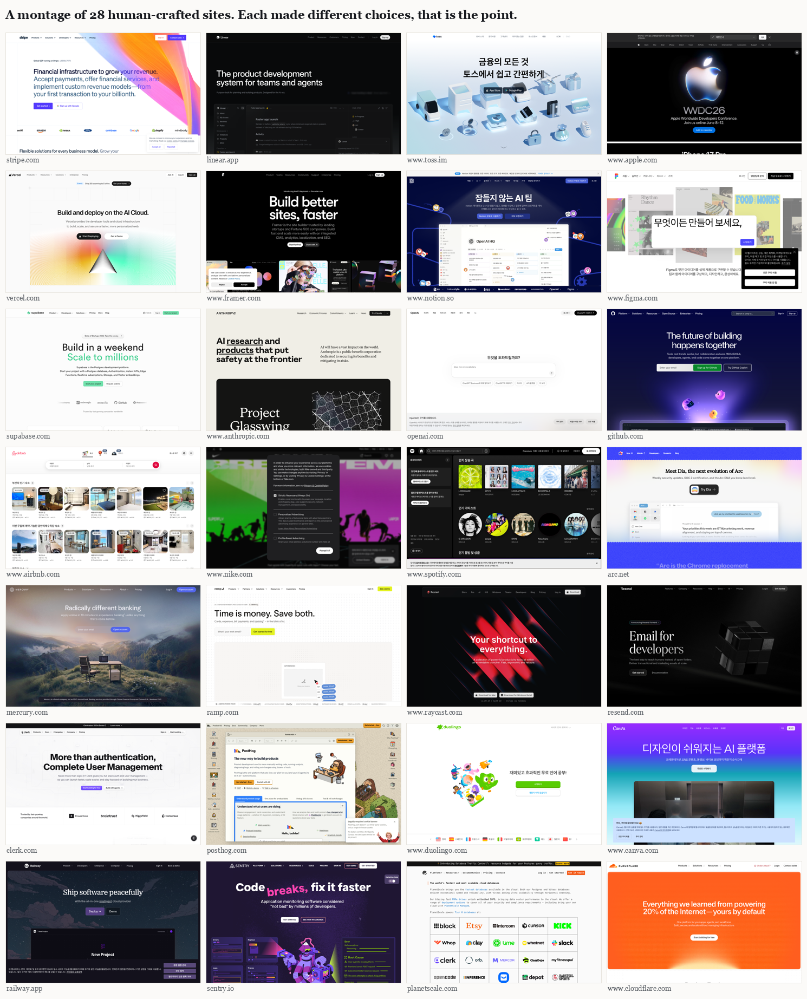
</p>
<p align="center"><sub>28 of the 202 sites. Dark and light, serif and grotesque, dense and airy, each made different choices. That variance is exactly what the AI default erases and what a low Tell Score protects.</sub></p>

The corpus (per-site signals + scores) ships in `data/`; re-run it with
`python src/scrape.py && python scripts/analyze_corpus.py && python scripts/validate_signals.py`.

## Component spec catalog (v3)

"Don't look AI" is a negative. So we also read the **positive**: the actual CSS
**199 design-led sites** ship, component by component, in **light and dark**.
For every site we render twice (once per `prefers-color-scheme`) and read the
computed button styles, the full type scale, layout containers, the spacing grid,
and the color palette. The aggregate is concrete targets, not vibes.

<p align="center">
  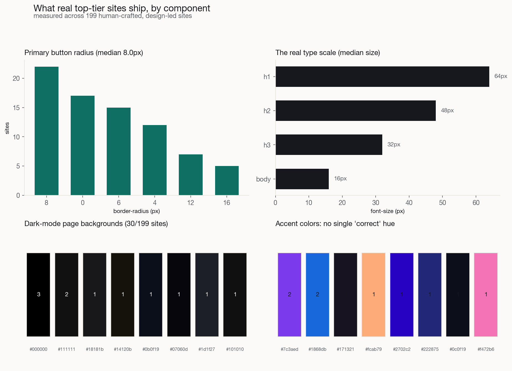
</p>
<p align="center"><sub>Measured across 199 sites. Primary-button radius splits between soft-round 8 to 12px and a full pill. The real type scale lands near 64/48/32/16px. Dark backgrounds are <b>tinted near-blacks</b>, never pure <code>#000</code>. Accent hues are all over the wheel, the hue is never the tell.</sub></p>

A few measured norms (full tables in [`reference/COMPONENT-SPECS.md`](reference/COMPONENT-SPECS.md)):

| Thing | What real sites do |
|---|---|
| **Primary button** | radius median **8px** (24% go full pill), padding ~**8px / 15px**, label **15px**, weight **500** (400 is common), only **13%** carry a shadow |
| **Type scale** | h1 **64px** / h2 **48px** / h3 **32px** / body **16px**; headlines tight line-height **~1.1** with negative tracking, body **~1.5** |
| **Layout** | content max-width median **1200px** (1440/1280/1200 common); section rhythm **~64px** top padding |
| **Spacing** | a 4/8px grid, not religiously; most-used steps 16, 8, 24, 12, 4, 32px |
| **Light** | page bg **#fff** / near-white; text a **near-black** (rarely pure #000 on pure #fff) |
| **Dark** | page bg a **tinted near-black** (`#0b0f19`, `#111`, `#18181b`...), surfaces a step lighter, text off-white |

Rebuild the catalog with
`python src/scrape_detail.py data/site_list_big.txt && python scripts/build_spec_catalog.py`.

### A sample built straight from the numbers

To prove the targets are buildable, [`fixtures/catalog-sample.html`](fixtures/catalog-sample.html)
is a landing page assembled from the catalog medians: a 1200px container, a 64/48/32px
type scale on a serif display, 8px buttons with every microstate, an owned amber accent
(not indigo), and a dark mode that follows the measured grammar. It scores **Tell Score 0**.

<p align="center">
  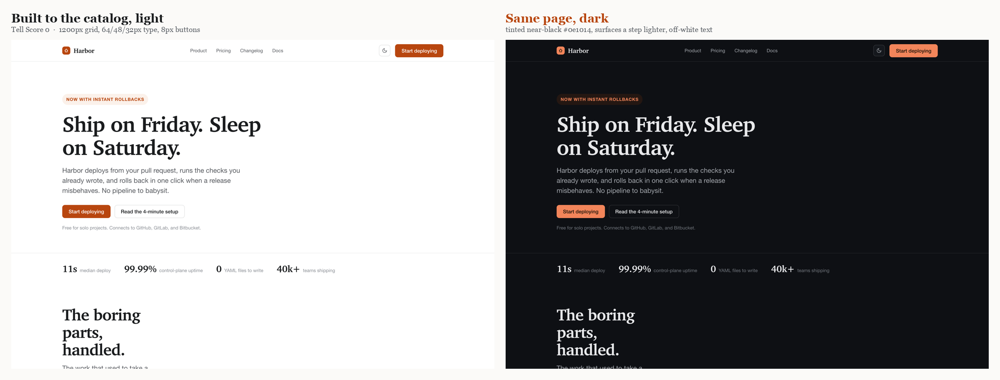
</p>
<p align="center"><sub>One self-contained file, both palettes. Dark is a <b>tinted</b> near-black (<code>#0e1014</code>) with surfaces a step lighter and off-white text, the grammar the catalog measured, not an invert to pure black.</sub></p>

<p align="center">
  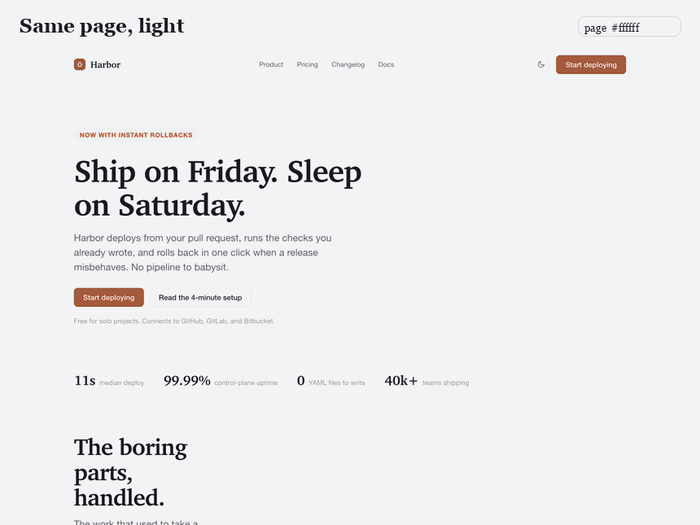
</p>

## Korean web (한글) catalog

The global catalog is mostly Western. Korean (hangul/CJK) type is set differently, so
we measured **48 Korean design-led sites** (Toss, Kakao, 당근, 무신사, 29CM, 오늘의집,
마켓컬리, 배민, 업비트 ...) the same way and compared.

<p align="center">
  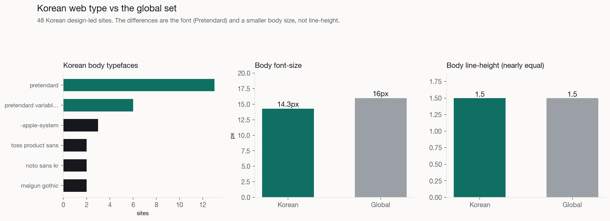
</p>

| | Korean sites | Global sites |
|---|---|---|
| **Default body font** | Pretendard / a hangul sans (**69%** a Korean face, **44%** Pretendard) | Inter / system sans |
| **Body font-size** | **14px** (clusters 13 to 15) | 16px |
| **Body line-height** | ~1.5 | ~1.5 |
| **h1 size** | bimodal (see below) | 64px |

What is actually different, honestly:

- **The font.** Pretendard is the Korean web's Inter: free, well-hinted, everywhere. The type tell translates directly, bare Pretendard with no scale reads machine-default the same way bare Inter does; the owned move is a commissioned face (Toss Product Sans, Bithumb Trading Sans, Gmarket Sans, Wanted Sans).
- **Body runs smaller**, 14px vs 16px. Hangul carries more ink per glyph, so 14px hangul reads at about the presence of 16px Latin; Korean product culture is denser too.
- **Line-height is *not* the difference** (both ~1.5). Pretendard already ships generous leading, so the median matches the West. Keep body leading 1.5 to 1.7 and you are inside both.
- **h1 is bimodal:** design-led product sites (Toss, 당근, 오늘의집) use 56 to 90px heroes like the West; portals and commerce (Naver, Coupang, Gmarket, SSG) are banner-driven with small or absent display headlines. The low median is Korean commerce density, not a different idea of a headline.

Full tables and a per-site appendix in [`reference/KOREAN-SPECS.md`](reference/KOREAN-SPECS.md);
rebuild with `python src/scrape_detail.py data/site_list_kr.txt` (writes to `data/sites_kr/`
via `DETAIL_OUT`) `&& python scripts/build_korean_catalog.py`.

## Field evidence: two production manifestos (v4)

The taxonomy so far was built from public craft writing and 202 scraped sites. The
sharpest confirmation came from the other direction: **two production codebases
whose maintainers had already written their own "avoid the AI look" design
manifestos**, and logged the cleanup with per-instance counts (one patched ~600
sub-12px labels to a 12px floor; another listed every `Sparkles` icon to remove).
Both are private commercial products, so they appear here anonymized: *Manifesto A*
(a dark-mode media tool, Toss-minimalism, one owned accent) and *Manifesto B* (a
productivity assistant, Pretendard, neutral hierarchy).

They independently named the tells the detector already had (the indigo default,
the blue→purple gradient, emoji-as-icon, generic fonts, vague copy). They also
named **six the v1–v3 taxonomy missed**, now added as **family H (AI
self-reference)** plus three more in existing families:

<p align="center">
  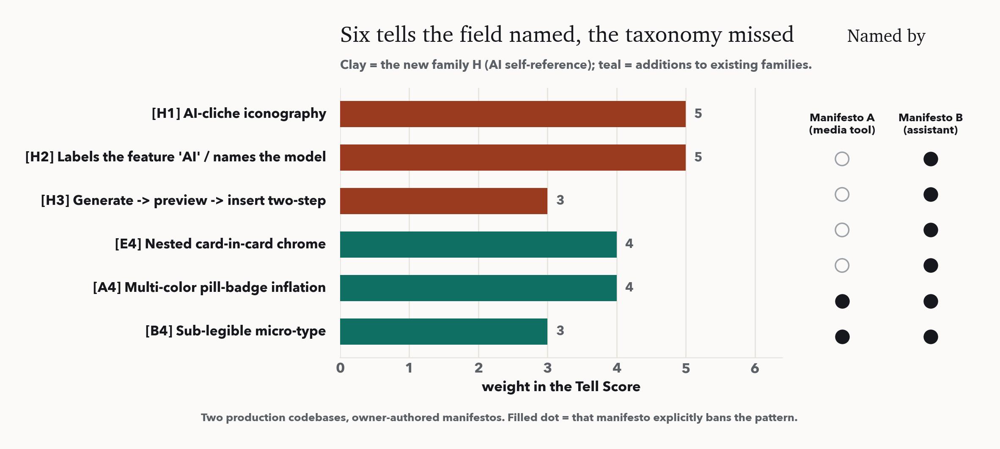
</p>

- **H1 AI-cliché iconography**, the `Sparkles` / `Wand` / `Bot` / `Brain` / `Cpu` icon set bolted onto any "AI" feature. *Manifesto B ranked it the #1 tell.*
- **H2 Labels the feature "AI" / names the model**, "AI-powered", "AI 분석", or an exposed `GPT-4` / `Claude` / `OpenAI` in the UI. Name the function by what it does; reveal the model only in settings.
- **H3 Generate → preview → insert two-step**, the assistant-panel ceremony. Apply the result into the content and let the user undo (⌘Z).
- **A4 Multi-color pill-badge inflation**, a row of status pills each in a different bright hue. When everything is colored, color stops meaning anything.
- **B4 Sub-legible micro-type**, scattered 9–11px labels. Set a 12px floor; build hierarchy with weight, not by shrinking.
- **E4 Nested card-in-card chrome**, the "double box". One outer card with a divide-y flat list, not a second framed surface.

These fire on the **file/code detector** (`score_design`, the harness you run on
the UI you just wrote), the use case where the markup is visible. They are not yet
wired into the live computed-style audit, which is stated as a limit, not hidden.

## The 27 tells

Eight families; each tell has a weight, a severity (**tell** = strong, *smell* =
weak/context-dependent), a mechanistic reason, and a fix. Source of truth:
[`src/taxonomy.py`](src/taxonomy.py).

Each tell has a **nickname** (the memorable handle) and a descriptive name.

| | tell | wt | the fix (what a designer does instead) |
|---|---|--:|---|
| **A · Color** | A1 **The House Indigo** · Indigo/violet default palette | 9 | a hue from the product's own brand; a perceptual ramp as semantic tokens |
| | A2 **The v0 Gradient** · Blue→purple hero gradient | 7 | a flat brand color or a one-hue gradient; reserve gradients for meaning |
| | A3 **Raw Ramp** · default-ramp utilities, no tokens *(smell)* | 4 | define `--color-*` semantic tokens before raw values |
| | A4 **Skittles Status** · multi-color pill-badge inflation *(smell)* | 4 | one or two status colors; lean on weight and a single dot |
| **B · Type** | B1 **Inter, Obviously** · Inter/Roboto/system default font | 9 | commit to a distinctive display face (Geist/Söhne-class) + readable body |
| | B2 **One Size Fits None** · no type scale discipline | 5 | a 4–6 step modular scale; size+weight+color build hierarchy |
| | B3 **Untracked** · no optical tracking on display *(smell)* | 3 | negative tracking on large headings (Linear: −0.22px display) |
| | B4 **The 10px Squint** · sub-legible micro-type *(smell)* | 3 | a 12px floor for real labels; hierarchy by weight, not by shrinking |
| **C · Layout** | C1 **The Three-Card Trick** · hero + three-feature-card template | 8 | let content dictate structure; vary shape, asymmetry, emphasis |
| | C2 **Dead Center** · center-everything composition | 5 | a real grid; left-align long-form; center only focal moments |
| | C3 **One Radius to Rule Them All** · one border-radius everywhere | 4 | scale radius with element size; nested radii differ |
| | C4 **The Emoji Reflex** · emoji as iconography *(smell)* | 3 | a coherent icon set matched to the brand's weight and grid |
| **D · Spacing** | D1 **24px Everywhere** · one padding token on every card | 5 | vary spacing to express grouping and importance |
| | D2 **Metronome Sections** · uniform section rhythm *(smell)* | 3 | modulate section spacing; give key moments more air |
| **E · Surface** | E1 **shadow-lg, Shipped** · generic diffuse shadow | 5 | design elevation: tight contained shadows, or layering + hairlines |
| | E2 **Frosted Everything** · glassmorphism overuse *(smell)* | 4 | reserve blur for layered surfaces; prefer solid high-contrast panels |
| | E3 **No Focus Given** · no hairlines / no `:focus-visible` | 6 | low-alpha hairlines + a visible high-contrast focus ring |
| | E4 **Box-in-a-Box** · nested card-in-card chrome | 4 | one outer card + a divide-y flat list; hairlines, not a second frame |
| **F · Motion** | F1 **Fade-in, Repeat** · one fade on everything *(smell)* | 4 | animate with intent; motion follows navigation/storytelling |
| | F2 **No Hover, No Care** · missing interactive microstates | 7 | design all six: default, hover, focus, active, disabled, loading |
| | F3 **Snap, Not Eased** · uneased transitions *(smell)* | 3 | define curves and durations (~150ms hover, 300ms state change) |
| **G · Copy** | G1 **Build the Future of ___** · vague aspirational headline | 6 | a specific, opinionated claim a founder would actually say |
| | G2 **Get Started, Again** · only generic CTAs *(smell)* | 4 | a CTA that predicts the next step in the product's own words |
| | G3 **Lorem Shipsum** · placeholder / lorem ipsum | 5 | write the real words; copy is UX, not filler |
| **H · AI self-reference** | H1 **The Sparkle Tax** · AI-cliché iconography | 5 | a function-true icon or the brand mark at AI entry points; never a sparkle |
| | H2 **Powered-by Theatre** · labels the feature "AI" / names the model | 5 | name the function by what it does; reveal the model only in settings |
| | H3 **The Insert Dance** · generate → preview → insert two-step *(smell)* | 3 | apply the result into the content; let the user undo (⌘Z) |

## The harness

The same taxonomy ships three ways, all generated from one source so guidance can
never drift from measurement.

**1 · CLI**, `python src/cli.py page.html` (or `ai-design-tells page.html` after
`pip install ai-design-tells`). Scores, prints fixes, exit-code gates CI.

**2 · MCP server**, so a coding agent can **audit the UI it just wrote before
showing it to you**, get the specific fixes, and iterate. The plugin/`uvx`
registration and the full tool table are up top in [Installation](#installation)
and [What your agent gets](#what-your-agent-gets-mcp-tools).
Cloned the repo instead of installing? `{ "command": "python", "args": ["mcp/server.py"] }` still works.

> Releasing a new version: bump `__version__` in `ai_design_tells/__init__.py`, then
> `git tag vX.Y.Z && git push origin vX.Y.Z`. `.github/workflows/publish.yml` builds
> and uploads to PyPI. (`ai-design-tells` is already live: pypi.org/project/ai-design-tells.)

**3 · Drop-in prompt module**, [`harness/AI-DESIGN-TELLS.md`](harness/AI-DESIGN-TELLS.md)
turns each *detected* tell into a *preventive* instruction plus a pre-ship
checklist. Paste it into a system prompt, `CLAUDE.md`, `.cursorrules`, or a
v0/Lovable custom-instructions field to shift the starting score down; the detector
then certifies the output.

The workflow: **generate → score → fix → re-score.**

## Figure gallery

<table>
<tr>
<td width="50%">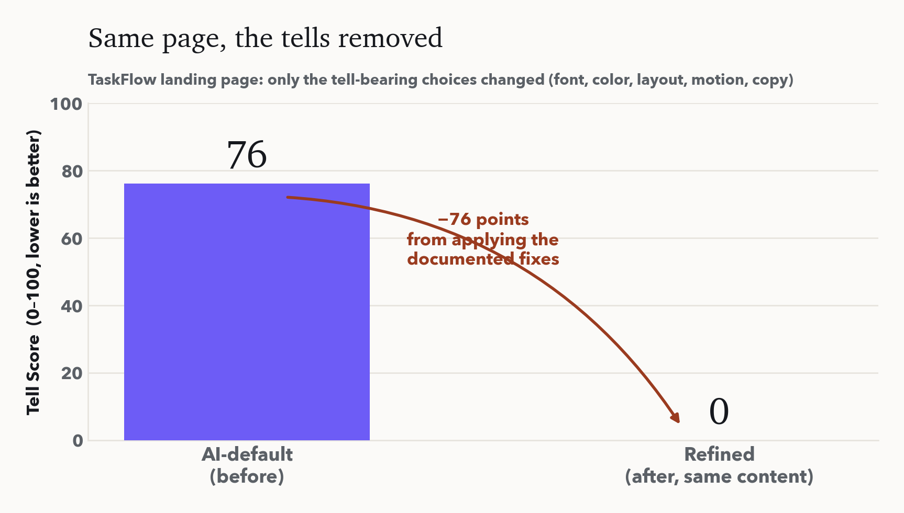<br><sub><b>Money shot.</b> Same page, −77 points from the documented fixes.</sub></td>
<td width="50%">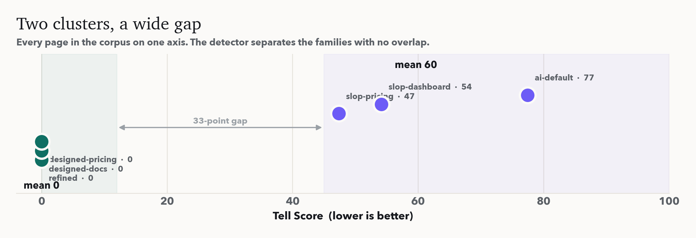<br><sub><b>Two clusters.</b> Every corpus page on one axis; no overlap.</sub></td>
</tr>
<tr>
<td width="50%">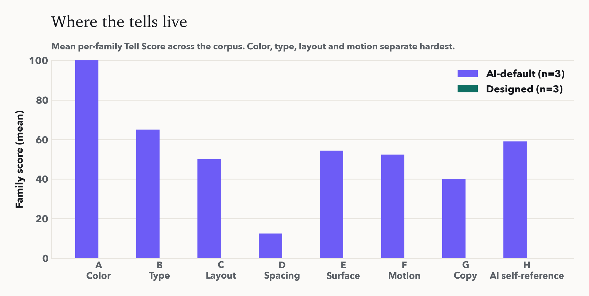<br><sub><b>Where the tells live.</b> Color, type, layout, motion separate hardest.</sub></td>
<td width="50%">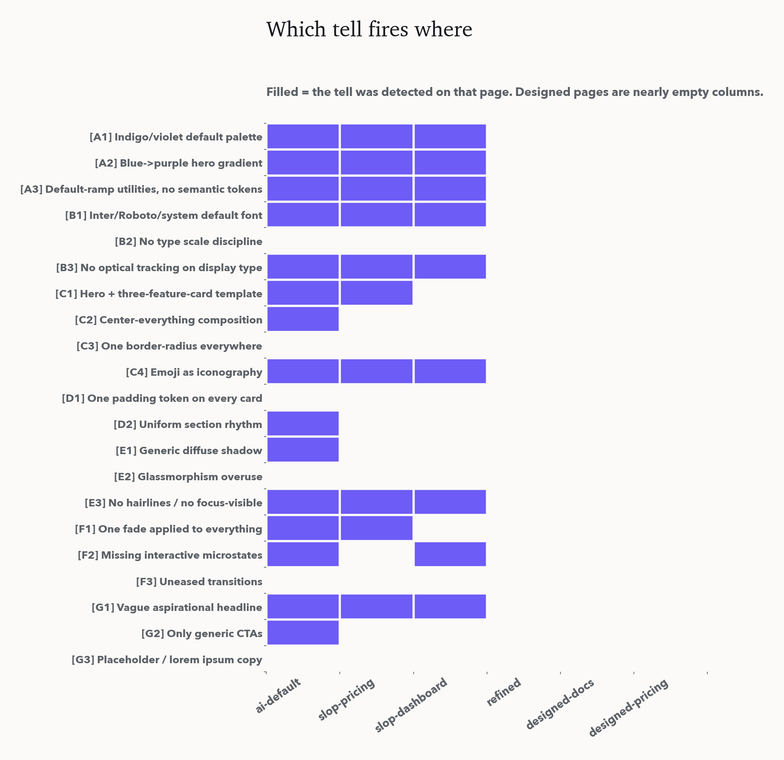<br><sub><b>Which tell fires where.</b> Designed pages are near-empty columns.</sub></td>
</tr>
</table>

## How it works

The detector ([`src/scorer.py`](src/scorer.py)) statically parses one self-contained
HTML document, inline `<style>`, `style=""` attributes, and **utility class
names**, with the standard library only. It resolves a useful subset of Tailwind
(color ramps → hexes, spacing/radius/text scales) so the same predicate fires
whether a page is written in classes or in CSS, expands `var()` one level so
token-based hairlines and easing are recognized, and computes color hue in HLS to
catch purples off the exact ramp. Each tell is a transparent predicate returning
*(fired, evidence)*. The **Tell Score** is the weighted fraction of the maximum
tell weight that fired:

```
S = 100 · Σ (weightₜ · firedₜ) / Σ weightₜ        ∈ [0, 100],  lower is better
```

Reproduce everything:

```bash
python -m venv .venv && source .venv/bin/activate
pip install -r requirements.txt          # only for figures + MCP
python scripts/run_audit.py              # -> results/scores.json
python scripts/make_figures.py           # -> paper/figs/*.png
python scripts/make_figure_field.py      # -> paper/figs/fig13_field.png (v4)
python scripts/make_gifs.py              # -> paper/figs/*.gif
bash   scripts/render.sh                 # -> fixture screenshots (needs Chrome)
typst  compile paper/paper.typ paper/paper.pdf
```

## Honest limits

- **A discriminator, not a beauty judge.** A low score means *free of machine
  defaults*, not *good*. Low is necessary, not sufficient. It's named **Tell**
  Score, not Design Score, on purpose.
- **Authored fixtures.** The corpus is controlled fixtures; designed pages score 0
  by construction. Claims rest on the confound-controlled refactor and the
  separation, not the absolute zeros.
- **Family H is code-detector only.** The AI-self-reference tells (sparkle icons,
  "AI" labels, the preview-insert flow) and the nested-box check read markup, so
  they fire in `score_design`/`score_file`, not yet in the live computed-style
  `audit_url`. The two source manifestos are a convenience sample, not a random one.
- **Live auditing works now (v2), with one residual blind spot.** The recalibrated
  detector renders the page and reads computed styles, so it audits deployed URLs.
  The one thing it cannot always see is `:focus-visible`, which the browser blocks
  for cross-origin stylesheets (Stripe). We confidence-gate it, firing only when the
  CSS is readable, so the failure mode is a missed tell, never a false accusation.
- **Time-bound.** These are mid-2020s model defaults; the list will need revision as
  distributions shift. The *method* (enumerate the mode, weight it, measure it)
  outlives any list.
- **Goodhart.** Gameable by cosmetic swaps; strong structural/microstate tells are
  weighted above cosmetics, but no static metric is Goodhart-proof. The score is a
  floor on intentionality, not a ceiling on craft.

## Paper

**The Tells: A Measurable Taxonomy of the AI-Generated Design Look, and a Harness to
Escape It.** Han Kim, IOV Labs, 2026. → [`paper/paper.pdf`](paper/paper.pdf) (15pp).
Technical (taxonomy, detector, metric, confound control) and philosophical (what
"looking human" detects, taste as compressed choice, the map-vs-territory limit, the
second-order convergence risk).

```bibtex
@misc{kim2026tells,
  title  = {The Tells: A Measurable Taxonomy of the AI-Generated Design Look,
            and a Harness to Escape It},
  author = {Kim, Han},
  year   = {2026},
  note   = {IOV Labs (아이오브연구소)},
  url    = {https://github.com/hankimis/ai-design-tells}
}
```

Companion study on AI-mediated homogenization:
[**Convergence Pressure**](https://github.com/hankimis/convergence-pressure), the
reflective loop, not AI assistance, is what collapses a population's diversity.

## Repo layout

```
ai_design_tells/    the installable package (pip install ai-design-tells)
  taxonomy.py        the 27 tells, single source of truth (detector, paper, harness derive from it)
  scorer.py          the static detector + Tell Score
  cli.py             the `ai-design-tells` command-line linter
  server.py          the MCP server (ai-design-tells-mcp)
  scrape.py          render a live site and read computed styles (audit_url)
  data/ harness/     bundled catalogs + drop-in harness, shipped in the wheel
src/, mcp/          thin compatibility shims so `python src/cli.py` / `python mcp/server.py` keep working
src/scrape_detail.py    deep per-component CSS extraction, light + dark (v3 spec catalog)
scripts/audit_url.py    audit a deployed URL; analyze_corpus.py learns calibration from data/
scripts/build_spec_catalog.py  aggregate sites_detail/ into reference/COMPONENT-SPECS.md
scripts/sync_package_assets.py  refresh the wheel's bundled data before a release
pyproject.toml      packaging (setuptools); .github/workflows/publish.yml = PyPI publish on tag
.claude-plugin/     Claude Code plugin + marketplace manifests; .mcp.json registers the MCP server (uvx)
harness/            AI-DESIGN-TELLS.md, drop-in prompt module (generated, now with measured targets)
reference/          COMPONENT-SPECS.md (199 sites) + KOREAN-SPECS.md (48 Korean sites)
scripts/build_korean_catalog.py  Korean web catalog + KR-vs-global comparison
fixtures/           7 sample pages (3 AI-default, 3 designed, 1 built-to-catalog light/dark), viewable templates
scripts/            run_audit, make_figures, make_gifs, render, gen_harness, build_spec_catalog
paper/              paper.typ, refs.bib, paper.pdf, figs/
data/               site corpora: per-site signals, sites_detail/, spec_catalog.json, calibration.json
results/            scores.json
DESIGN.md           pre-registration (hypotheses, confound controls)
```

<p align="center"><sub>IOV Labs (아이오브연구소) · <a href="mailto:hankim@iovstudio.kr">hankim@iovstudio.kr</a> · MIT</sub></p>
